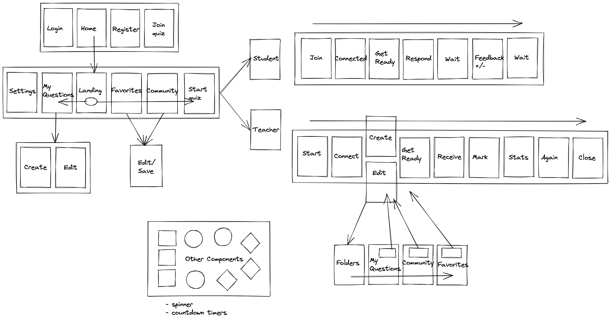
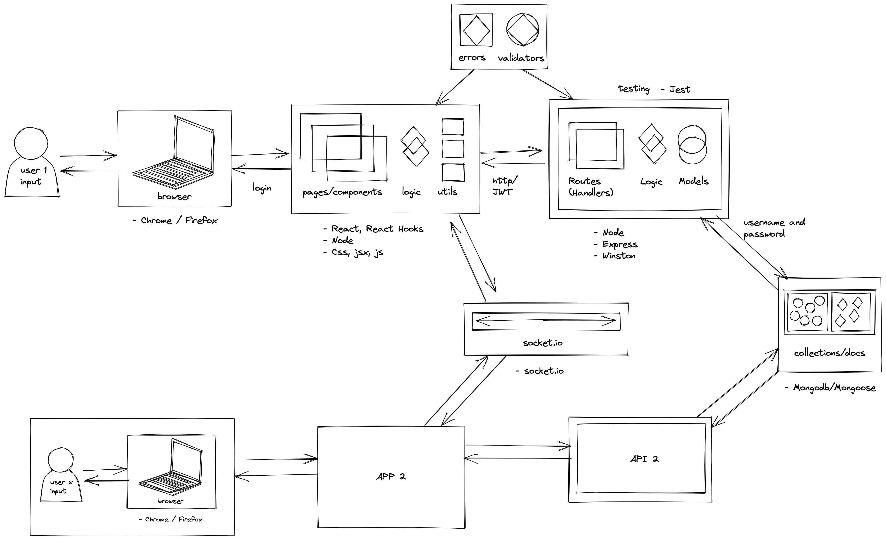
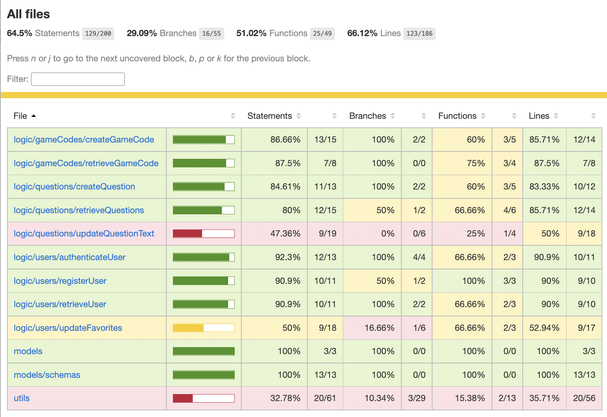

# Quizz Buzz

<!-- <iframe src="https://giphy.com/embed/MT5UUV1d4CXE2A37Dg" width="480" height="480" frameBorder="0" class="giphy-embed" allowFullScreen></iframe>
<a href="https://giphy.com/gifs/Giflytics-MT5UUV1d4CXE2A37Dg">via GIPHY</a>
 -->

Quizz Buzz is an app for sending out quiz questions in an interactice and spontaneous way. I can be used alongside any group activities in classrooms, workshops, conferences or for fun with friends and family. It has been designed to focus on providing users with the opportunity to both send previously-created questions, and also create questions and make any necessary edits during quiz time. The user has access to a whole community of public questions and those who join a game that has been set up don't need to log in or sign up, so no time is wasted.

In future versions more options for question types and competetive aspects such as betting and points and leaderboards will be added. The Quizz Buzz app a great opportunity fopr those using textbooks and paper to make activities more interactive. Further development to the user's site might include tools to help prepare a wider variety of educational resources that can be shared amongst the community, printed for use in workshops, classrooms and conferences, and used with the Quizz Buzz game feautures.

## Functional Description

### Use Cases

- A non-logged-in user can:
- register to sign up for an account
- log-in to their account with password authentication
- join and participate in a quiz game that has been set up by a logged-in user

- A logged-in user can:
- change their name, email, and password from the settings screen
- navigate to see a list of their own questions
- navigate to see a list of public question in the community
- navigate to see a list of their favourite public question
- create a new question
- edit their own questions
- edit and save a copy of a public question
- dynamically select their favourite questions to have question lists and components rerendered instantaneously
- search all three types of question lists for key words
- change the color theme of the application
- join a game as a 'student'
- set up and start a game as a 'teacher'
- logout

- When creating a question a user can:
- set the time-limit for the question using a dropdown menu
- set the visibility (public/private) for the question using a dropdown menu
- decide which type of question they want to send (written response or multiple choice)
- write the question they want to be sent
- write a suggested answer (optional and only for written response)
- write four multiple choice answer options (multiple choice)
- dynamically set which of the multiple choice answers are correct (one or many)

During a quiz game a ´Teacher' can:

- enter the name of the 'class' to generate a pin
- see who has connected tp the quiz
- create, save and send a new question
- search their own questions, public questions and favorite questions for a question to use in the quiz
- retrieve a question the want to use and edit before sending
- send a question to the students and see their incoming responses
- end the round early if there is an excess of time
- decide dynamically decide which written responses are correct by clicking the responses
- send feedback to individual participants
- see stats of correct and incorrect responses
- create or search for a new querstion and continue playing
- close the game for all who are joined

During a quiz game a 'student' can:

- connect to a quiz game by entering the code and class name
- decide a nickname for themselves for the game
- wait for questions to be sent
- reponse to the question received by writing a written response or dynamically selecting their chosen answers before sending
- wait for feedback to be sent
- see their feedback and interact with the feedback scrren to spray cofetti

### Flows

### UI design (wireframes)

Below is the initial Figma flow that inspired the project. This flow shows the quiz game interaction for written response questions. Since this flow was designed functionality such as the multiple-choice question, access to a user community with favourites, ability to retrieve questions in-game, and the ability to edit and save public questions has been added.

[Figma](https://www.figma.com/file/rx2P53dsCr1Ed5DFpMMoip/Kahoot-App-v1?node-id=0%3A1)

## Technical Description

### Blocks

### Code Coverage (Testing)

### Technologies

- Javascript, JSX, CSS, SASS, HTML
- React
- Node.js
- Express.js
- Mongoose from MongoDB
- Jest
- Winston
- Socket.io

## Roadmap

### Version 0

- manage users
- crud questions
- create and retrieve game codes
- create, retrieve and update users
- set-up quiz game
- join quiz-game
- support public / private notes
- public notes feed
- favorites
- edit and copy notes
-

### Version 1

- likes and dislikes function
- collections function to create collections of questions with tags
- descriptions saved to collections, ability to copy and edit public collections
- choose multiple questions to load for test and create a wait list
- pagination of question list pages
- function to be able to give bets while playing th quiz game
- function to be able to award points during the quiz game
- more detailed stats in the feedback of the quiz game on the teacher's side
- 'recently played' questions list
- profile questions

### Version 2

- other question types such as sort and match
- the ability to upload media to the questions
- music options during gameplay
- tools to help automate the production of resources and worksheets for use in classrooms and workshops
- ways of utilising the game connection to make the use of these resources interactive

## Tasks

Sprint 0

- DONE figma
- TODO data model
- TODO figma to react
- TODO data model to mongoose
- TODO implement users logic
- TODO implement users api routes
- TODO ...

Sprint 1

- TODO ...

Sprint 2

- TODO ...

Sprint 3

- TODO ...

# TODOs:

## Priority:

- Bug fix - answers from the student arriving to teacher two times in quiz
- Bug fix - pages not loading correctly on refresh
- finish logic testing
- verifyToken in retrieveGameCode, deleteQuestion and searchQuestionsPublic routeHandler then pass userId to logic to check wih db
- complete documentation of app logic
- validation of inputs in app and api
- improved validation passwoprds, email, other details using RegEx
- search and correction of potential errors and warnings in game play
- logic documentation
- management of token - autorenovation if user is still active

## Other TODOs:

- correction of css - change placeholders to white
- css - improve themes
- save themes to user document in db
- reset forgotten password functionality
- improve validation of game input
- change the naming of the files from Teacher/Student to something more general e.g. Host/Guest or Host/Player
- change updatePassword file/logic name to updateDetails
